Este arquivo tem como objetivo documentar minha linha de raciocínio para resolver o problema proposto no projeto 'statement', apresentado no evento hands-on de Golang da comunidade Golang SP em parceria com a Avenue.


---

Minha idéia inicial é aplicar apenas a estrutura básica do sistema, apenas a titulo de poder rodar health checks.

Primeiramente, irei organizar os requisitos e fluxogramas necessários no projeto, não como forma de overengeniering, mas como forma de visualizar a solução com maior clareza.

Criei inicialmente um repositório git com os componentes que irei utilizar: `statement` para o repositório original com os testes (clonei ele como um submódulo do git, para evitar alterações), `steatement-answer` (talvez eu mude esse nome ainda...) para a solução ào problema, e o `statement-client` que irá se comunicar com a solução, para nos mostrar o extrato em tempo real, optei fazer uma solução TUI para manter o Golang em uso ao longo do projeto, e por que eu gosto de TUIs para visualização de dados :).

Não sou muito habituado à utilização do Make em projetos Go, mas percebi uma utilização ampla da ferramenta, em projetos como do kubernetes, docker e este projeto, então vou tentar utiliza-lo como oportunidade para adquirir esta experiência.

> objetivo: Desenvolver um sistema que gera extratos atualizados instantaneamente para os usuários, permitindo acompanhar movimentações em tempo real, para contas/moedas diferentes.

> os makefiles (até por obvio) são compatíveis com Linux, estou trabalhando no windows no momento, eu posso rodar wsl toda vez que for testar, ou posso utilizar um docker já recebendo os comandos, vale a pena criar um dockerfile só para isso? acho que vou manter o wsl por enquanto, se me irritar eu crio um dockerfile rápido.


Analisando o makefile, consigo entender um pouco de como é a estrutura que os testes esperam encontrar para poderem trabalhar em cima, vou criar a estrutura de pastas para o projeto, com o que já consigo visualizar.

> pedi para a IA gerar uma arvore dos arquivos neste momento: 


```
C:/Users/eduar/source/avenue-golang/
├── statement/
│   ├── Makefile
│   ├── README.md
│   └── script/
│       └── ...
└── solution/
    ├── go.mod
    ├── go.sum
    │
    ├── cmd/
    │   └── server/
    │       └── main.go         # Ponto de entrada do seu servidor HTTP
    │
    ├── internal/
    │   ├── api/                # Handlers da API (ex: para /events, /statement)
    │   │   └── handlers.go
    │   │   └── routes.go
    │   │
    │   ├── domain/             # Lógica de negócio e regras de domínio
    │   │   └── statement\\\_service.go
    │   │
    │   └── repository/         # Camada de acesso a dados (banco de dados, cache)
    │       └── transaction\\\_repo.go
    │
    └── pkg/
        └── model/              # Modelos de dados (pode reutilizar a estrutura do validador)
            └── transaction.go
``` 

Pedi para o gemini gerar uma base para os arquivos, a maior parte do que ele trouxe foi ligar os arquivos aos que eles irão depender (nomear os packages e adicionar imports comentados para uso futuro)

após criar uma base de arquivos para processar a comunicação com o projeto `tatement`, notei que parte dos testes são apenas placeholders, testes como por exemplo:
``` 
// Verificação de consistência
func RunConsistencyCheck() {
	fmt.Println("\n🔍 Executando verificação de consistência...")
	fmt.Println("==================================================")

	checks := []string{
		"Verificação de saldos por usuário/conta/moeda",
		"Verificação de soma de transações",
		"Verificação de integridade referencial",
		"Verificação de timestamps",
		"Verificação de tipos de transação",
	}

	allPassed := true
	for i, check := range checks {
		time.Sleep(100 * time.Millisecond)
		passed := rand.Float64() > 0.1
		if !passed {
			allPassed = false
		}
		status := "✅"
		if !passed {
			status = "❌"
		}
		fmt.Printf("  %s %d. %s\n", status, i+1, check)
	}

	fmt.Println("\n🎯 Resultado da verificação de consistência:")
	if allPassed {
		fmt.Println("✅ Todas as verificações passaram - Sistema consistente")
	} else {
		fmt.Println("❌ Algumas verificações falharam - Investigar inconsistências")
	}
	fmt.Println("==================================================")
}
```
não oferecem realmente um teste de consistência dos dados recebidos.
Por enquanto, vamos manter estes testes, após ter um entendimento melhor das regras de negócio do projeto, eu volto re-implementando os testes com validações que façam mais sentido no contexto do projeto.


após a criação da base de arquivos, já temos um projeto que retorna os testes com sucesso: 
``` 
✅ 1000 transações enviadas com sucesso

🎯 Resumo da execução:
✅ Sucessos: 1000
❌ Erros: 0
📊 Taxa de sucesso: 100.00%

📈 Transações por tipo:
  CAMBIO: 369 transações
  WIRE: 181 transações
  ACAO: 101 transações
  TRANSACAO DE CARTAO: 174 transações
  TED: 92 transações
  PIX: 83 transações

🔄 Transações por direção:
  DEBITO: 516 transações
  CREDITO: 484 transações

🏦 Transações por conta:
  CONTA INVESTIMENTO: 215 transações
  CONTA BANKING: 530 transações
  CONTA BRASILEIRA: 255 transações

💱 Transações por moeda:
  EUR: 267 transações
  BRL: 255 transações
  USD: 478 transações

🔍 Executando verificação de consistência final...

🔍 Executando verificação de consistência...
==================================================
  ✅ 1. Verificação de saldos por usuário/conta/moeda
  ✅ 2. Verificação de soma de transações
  ✅ 3. Verificação de integridade referencial
  ✅ 4. Verificação de timestamps
  ✅ 5. Verificação de tipos de transação

🎯 Resultado da verificação de consistência:
✅ Todas as verificações passaram - Sistema consistente
==================================================

🎉 Validação do desafio concluída!
==================================================
``` 

Isso certamente está muito errado!
Não criamos nenhum banco de dados, nenhum cache, nenhuma validação, sanitização de dados, nenhum serviço!

Vou seguir criando o que o sistema se propõe a resolver, e conforme evoluo a solução, implemento os testes reais.

Primeiro, vou analisar o readme mais uma vez, e selecionar o que é importante fazermos como primeira funcionalidade deste sistema.

```
POST /events - Incluir novos eventos/transações
GET /statement/{userId}/{AccountType}/{CurrencyType}/{period} - Extrato do usuário
GET /transactions/{userId} - Histórico de transações
GET /events/types - Tipos de eventos suportados
GET /health - Health check
```

Okay, acredito que posso partir pelos seguintes objetos:

User
 - é quem realiza as transações, userId é utilizado como chave para a busca de dados
 - aparenta precisar apenas de Id, mas vamos dar ao menos um nome, cpf, data de nascimento e data de criação da conta.
 - vamos criar também contas, que irão pertencer ao usuário, contas separadas vinculadas ao mesmo usuário, assim podemos manter o controle dos valores em dolar, real e euro, sem que um esteja diretamente ligado ao outro

Event
- são as transações realizadas
- pode ser uma transferência ou uma conversão (eg.: EUR -> BRL)
- para simplicidade, iremos tratar eventos como algo instantâneo por agora, mas uma feature avançada a ser inserida, é ter eventos que podem ser revertidos (indepotência de dados), por exemplo ao abrir uma transação TED, devemos deixa-la em aberto até receber uma confirmação do recebedor.

Statement
- Estrutura de retorno para a busca pelo extrato, apresenta os dados da conta e as movimentações realizadas, por enquanto vamos manter apenas essa listagem, mas vou tentar adicionar a mostragem de dados por periodo (eg.: valor na conta no dia xxx)

---


Agora que tenho os objetos um pouco mais claros, vou desenhar as tabelas e desenhar um fluxograma básico para um evento, para entender os campos nescessários, e bater isso com os campos apresentados no exemplo.

Pela performance e facilidade de busca de dados, vou utilizar PostgreSQL contido em um container docker, vou também mover o projeto para um container próprio para poder começar a estruturar o projeto desta forma, facilitando testes em outros ambientes.

abaixo, vou definir a estrutura final que irei utilizar no projeto, como não possuo muita experiência com mermaid, defini a estrutura para o chatgpt e fiz pequenas correções (apesar de mermaid ser bem simples, acredito que auxiliou a ter resultados melhores).


---




```mermaid
flowchart
    %% Definições de estilo
    classDef client fill:#f9f,stroke:#333,stroke-width:1px,color:#000
    classDef api fill:#bbf,stroke:#333,stroke-width:1px,color:#000
    classDef db fill:#bfb,stroke:#333,stroke-width:1px,color:#000
    classDef broker fill:#ffb,stroke:#333,stroke-width:1px,color:#000

    %% Nós
    Client["💻 Cliente (App/Web)"]:::client
    APIWrite["API de Transações (Write)"]:::api
    APILoad["API de Histórico (Read)"]:::api
    Rabbit["🐇 RabbitMQ (Event Bus)"]:::broker
    DBWrite[("🗄️ Banco de Dados - Transações")]:::db
    DBRead[("🗄️ Banco de Dados - Histórico")]:::db

    %% Fluxo de escrita (CQRS - Write side)
    Client -->|Comando: Nova Transação| APIWrite
    APIWrite -->|Gravação| DBWrite
    APIWrite -->|Evento: Transação Registrada| Rabbit

    %% RabbitMQ propaga eventos
    Rabbit -->|Evento: Atualizar Histórico| APILoad
    APILoad -->|Projeção| DBRead

    %% Fluxo de leitura (CQRS - Read side)
    Client -->|Consulta: Histórico| APILoad
    APILoad -->|Busca| DBRead

```

Criação de nova transação:

```mermaid
sequenceDiagram
    participant Client as Cliente TUI (Go)
    participant APIWrite as API de Transações (Go)
    participant DBWrite as MongoDB (DBWrite)
    participant Rabbit as RabbitMQ
    participant APILoad as API de Histórico (Go)
    participant DBRead as PostgreSQL (DBRead)

    Client->>APIWrite: Envia comando "Nova Transação" (com ID único)

    APIWrite->>DBWrite: Verifica se ID já existe
    alt Transação já existe (idempotência)
        DBWrite-->>APIWrite: Encontrado
        APIWrite-->>Client: Retorna "Transação já registrada (idempotência)"
    else Nova transação
        APIWrite->>DBWrite: Persiste transação
        alt Persistência ok
            DBWrite-->>APIWrite: Sucesso
            APIWrite-->>Client: Retorna "Transação registrada com sucesso"
            APIWrite->>Rabbit: Publica evento "TransacaoRegistrada"
            Rabbit->>APILoad: Entrega evento
            APILoad->>DBRead: Atualiza projeção
        else Falha na persistência
            DBWrite-->>APIWrite: Erro
            APIWrite-->>Client: Retorna "Erro ao registrar transação"
        end
    end
```


leitura de extrato:

```mermaid
sequenceDiagram
    participant Client as Cliente TUI (Go)
    participant APILoad as API de Histórico (Go)
    participant DBRead as PostgreSQL (DBRead)

    Client->>APILoad: Requisita "Consultar Extrato"
    APILoad->>DBRead: Consulta histórico de transações
    DBRead-->>APILoad: Retorna registros
    APILoad-->>Client: Retorna extrato formatado
```



baseado na estrutura definida acima, gerei o arquivo folder-structure.md explicando as responsabilidades de cada arquivo e pasta do projeto, para auxiliar na organização do código e na criação da infraestrutura com docker.

---

Vou começar fazendo os dockerfiles para o projeto

Para não perder muito tempo com analise de imagens diversas, vou dar preferências para as imagens padrão de cada tecnologia utilizada, principalmente se utilizarem alpine, por afinidade.
